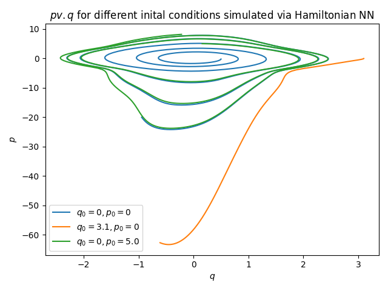

# Harmonic: Hamiltonian Neural Networks (HNN)
___

### To be used with this blog post: [Training a Hamiltonian Neural Network: Using an NN for Simulating the Phase Space of a Harmonic Oscillator](https://github.com/ritog/harmonic)
___

This repository explores the implementation and training of **Hamiltonian Neural Networks (HNN)** to model physical systems, specifically focusing on the nonlinear pendulum. Unlike standard neural networks that learn direct mappings, HNNs learn the underlying Hamiltonian of a system, ensuring that the learned dynamics respect fundamental physical laws like energy conservation.

## Overview

Hamiltonian mechanics describes the evolution of a system in phase space $(q, p)$ using a scalar function called the Hamiltonian $H(q, p)$, which typically represents the total energy. The equations of motion are given by:
$$\frac{dq}{dt} = \frac{\partial H}{\partial p}, \quad \frac{dp}{dt} = -\frac{\partial H}{\partial q}$$

This project demonstrates how to:
1. Define an HNN architecture.
2. Calculate time derivatives using the symplectic swap and PyTorch's `autograd`.
3. Train the network on synthetic data generated from pendulum dynamics.
4. Simulate the system using both ground truth and learned dynamics.
5. Visualize Liouville's theorem (phase space volume conservation).

## File Guide

### Core Model & Training
- **`HNN.py`**: Contains the `HNN` class, a simple MLP that outputs a scalar value representing the learned Hamiltonian.
- **`hnn_training.py`**: The main training script. It generates synthetic pendulum data and trains the HNN to minimize the difference between predicted and true time derivatives.
- **`hnn_model_derivs.py`**: Implements `get_model_time_derivatives`, which uses the HNN and Hamilton's equations to compute $\dot{q}$ and $\dot{p}$.

### Physics & Simulation
- **`pendulum_nonlinear.py`**: Defines the ground truth dynamics for a rigid nonlinear pendulum using NumPy.
- **`pendulum_tensor.py`**: A PyTorch-compatible implementation of the pendulum dynamics for efficient batch processing.
- **`rigid_simulator_implicit.py`**: Simulates the pendulum's trajectory using the ground truth dynamics and an semi-implicit Euler integrator.
- **`rigid_simulator_HNN.py`**: Simulates the pendulum's trajectory using the pre-trained HNN model.

### Artifacts
- **`hamiltonian_nn_1.pth`**: The saved weights of a trained HNN model.
- **`FIG4.png` & `FIG5.png`**: Visualizations of phase space distributions and simulated trajectories.

## Getting Started

### Prerequisites
This project uses `uv` for dependency management. Ensure you have it installed.

### Installation
Clone the repository and install dependencies:
```bash
git clone https://github.com/your-username/harmonic.git
cd harmonic
uv sync
```

### Usage
1. **Train the HNN**:
   ```bash
   uv run python hnn_training.py
   ```
2. **Simulate with HNN**:
   ```bash
   uv run python rigid_simulator_HNN.py
   ```
3. **Run Liouville's Theorem Demo**:
   ```bash
   uv run python dist_dynamic.py
   ```

## Results
The trained HNN is able to capture the periodic orbits of the pendulum in phase space, maintaining energy conservation over long periods, a feat often difficult for standard RNNs or MLPs.



*Figure: Trajectories in phase space $(q, p)$ for different initial conditions simulated via Hamiltonian NN.*
